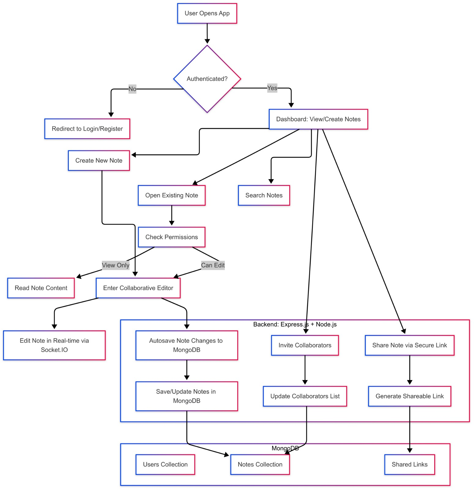

# 📝Pen2Gether

A real-time collaborative note-taking application where users can create, edit, share, and collaborate on notes. Built with **Node.js**, **Express.js**, **MongoDB**, and **Socket.IO**, this app supports live editing.

**You can check our project live at [Link](http://pen2gether.netlify.app). Feel free to explore the features!**

## 🔍 Features
 - 🔐 Authentication System (Login/Register)
 - 📋 Create, Read, Update Notes
 - 🧠 Collaborative Editing with real-time updates
 - 👥 Invite Collaborators
 - 💾 Autosave to MongoDB


## Application flow



## 🛠 Tech Stack
- Frontend: React.js
- Backend: Node.js + Express.js
- Database: MongoDB
- Real-time: Socket.IO
- Authentication: JWT


## 🚀 Setup Instructions

### 💻Frontend setup
```
cd src
cd client
npm install
npm run dev
```

### ⚒️ Backend Setup

```
cd src
npm install
npm start
```

*Ensure to add `.env` file to the project*

#### `.env_sample`:

```
MONGODB_URI=<database_url>
JWT_SECRET=<jwt_Secret>
EMAIL=<email-id>
PASSWORD=<password>
FRONTEND_URL=<frontend-url>
PORT=8000
VITE_APP_BACKEND_URL=<backend-url>
VITE_APP_SOCKET_URL=<socker-url>
BACKEND_URL=<backend-url>
SOCKET_URL=<frontend-url>
```

## 🧑‍💻 Contributors
- [Amruta Jayanti](https://www.linkedin.com/in/amruta-jayanti)
- [K. Sneha Deepthi](https://www.linkedin.com/in/sneha-deepthi11/)
- [K. Aswini](https://www.linkedin.com/in/aswini-kommineni-a0a33a244/)
- [G. Tejaswi](https://www.linkedin.com/in/tejaswi-gandepalli/)


